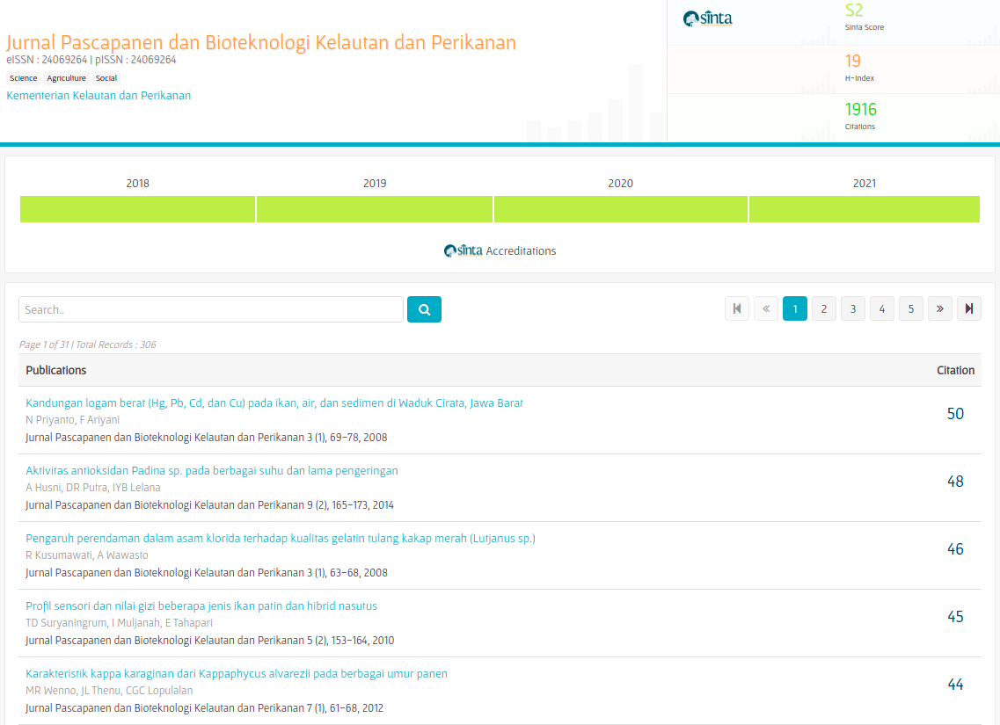
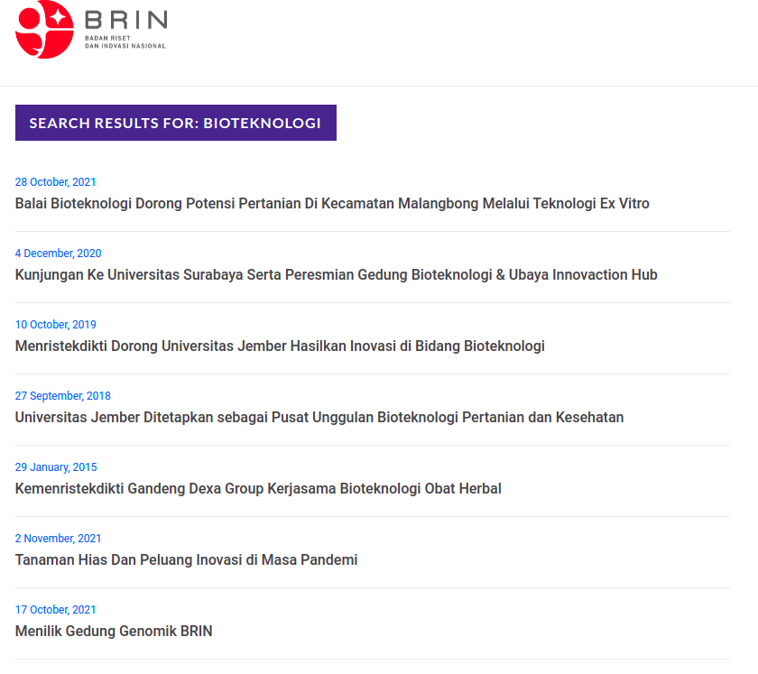

```{r setup, include=FALSE}
knitr::opts_chunk$set(echo = TRUE)
rm(list=ls())

setwd("~/AIPG-Gamma/Pilot")

library(dplyr)
library(ggplot2)
```

\newpage
\tableofcontents
\newpage
\listoffigures
\newpage
\listoftables
\newpage

# PENDAHULUAN

## Latar Belakang

Komite Gama memiliki kebutuhan untuk melakukan inventarisasi terhadap:

1. Kegiatan pendidikan (formal atau non-formal). Termasuk program pendidikan yang telah dilakukan atau akan direncanakan.
1. Kegiatan penelitian (riset dan inovasi). Termasuk program pendidikan yang telah dilakukan atau akan direncanakan.

pada sektor __produksi pangan__, __rantai pasokan pangan__, dan __konsumsi pangan__.

## Masalah

Informasi terkait kegiatan-kegiatan di atas tersebar di berbagai situs seperti pada portal:

1. Neliti^[https://www.neliti.com/].
1. BRIN^[https://www.brin.go.id/].
1. SINTA^[https://sinta.ristekbrin.go.id/].
1. dan berbagai situs lainnya.

Bagaimana cara kita bisa mendokumentasikan data kegiatan-kegiatan yang ada pada situs-situs tersebut?

## Tujuan

Melakukan _big data mining_ untuk mendokumentasikan kegiatan-kegiatan di situs-situs tersebut sekaligus membuat _data base_ yang _reliable_ terhadap topik terkait.

\newpage

# METODE

## _Web Scraping_

Metode yang akan digunakan dalam _big data mining_ kali ini adalah _web scraping_, yakni mengambil data yang terlihat secara visual pada suatu situs dengan cara melakukan _parsing html file_. 

Untuk melakukan itu, saya membuat _custom algorithm_ persitus yang dituju menggunakan bahasa pemrograman __R__.

## _Data Carpentry_

Data yang diambil dari _web scraping_ akan dibersihkan dan dibuat konsisten baik struktur dan formatnya. Data akan diekspor dalam bentuk tabel Microsoft Excel.

\newpage

# _PILOT PROJECT_

Saya akan mencoba mengambil beberapa data yang relevan terkait suatu _keyword_ pada _pilot project_ ini. 

## _Keyword_ yang Digunakan

_Keyword_ yang digunakan pada _pilot project_ ini adalah __bioteknologi__.

## Hasil _Big Data Mining_

Berikut adalah hasil penelusuran _keyword_ __bioteknologi__.

### Kegiatan Penelitian

Hasil penelusuran pada kegiatan penelitian di bidang __bioteknologi__ saya dapatkan dengan cara mencari _keyword_ tersebut di situs __neliti__^[https://www.neliti.com/] dan __SINTA__^[https://sinta.ristekbrin.go.id/]. Semua jurnal yang muncul akan saya ambil informasinya sebagai bukti pelaksanaan riset dan inovasi terkait _keyword_ tersebut.

#### Situs `neliti`

Pada situs ini, saya spesifik akan mencari __jurnal__ yang terkait dengan _keyword_. Sebagai contoh:

```{r out.width="65%",echo=FALSE,fig.align='center',fig.retina=10,fig.cap="Contoh Halaman Depan dari Situs Jurnal Hasil Penelusuran di neliti"}

```

Informasi yang akan diambil dari halaman situs tersebut antara lain:

1. Judul,
1. Penulis,
1. Tahun penerbitan,
1. Abstrak,
1. _Link_ situs.

```{r, include=FALSE}
load("~/AIPG-Gamma/Pilot/neliti/neliti.rda")
```

Pada saat saya melakukan _web scraping_ pada `11 November 2021 17:20 WIB`, tercatat ada `r nrow(data_neliti)` buah jurnal di situs `neliti`. 

Data hasil _web scraping_ terlampir.

#### Situs `SINTA`

Pada situs SINTA, saya akan spesifik mencari jurnal yang terkait _keyword_. Berikut adalah hasil pencariannya:

```{r out.width="85%",echo=FALSE,fig.align='center',fig.retina=10,fig.cap="Contoh Halaman Depan dari Situs SINTA Hasil Penelusuran"}

rm(list=ls())
load("~/AIPG-Gamma/Pilot/sinta/sinta.rda")
```

Informasi yang akan diambil dari halaman situs tersebut antara lain:

1. Judul,
1. Penulis,
1. Nama jurnal,
1. Berapa banyak tersitasi,
1. _Link_ situs.

Pada saat saya melakukan _web scraping_ pada `11 November 2021 21:57 WIB`, tercatat ada `r nrow(data_sinta_clean)` buah jurnal di situs `SINTA`. 

Data hasil _web scraping_ terlampir.

### Kegiatan Lainnya

Salah satu kesulitan yang dihadapi adalah pada saat mencari informasi seputar kegiatan pendidikan formal atau non formal (pelatihan). Sebagai iterasi pertama, saya akan coba menelusuri _keyword_ di situs `BRIN` dan mengambil semua artikel atau berita terkait.

#### Situs `BRIN`

Berikut adalah hasil penelusuran _keyword_ di situs `BRIN`:

```{r out.width="85%",echo=FALSE,fig.align='center',fig.retina=10,fig.cap="Contoh Halaman Depan dari Situs BRIN Hasil Penelusuran"}

load("~/AIPG-Gamma/Pilot/brin/brin.rda")
```

Informasi yang akan saya ambil adalah:

1. Judul artikel,
1. Tanggal artikel,
1. Isi artikel.

Kelak kita akan coba pilah, apakah ada unsur pendidikan formal, __pelatihan__ atau ___training___ dari artikel tersebut.

Pada saat saya melakukan _web scraping_ pada `11 November 2021 22:21 WIB`, tercatat ada `r nrow(artikel_final)` buah artikel di situs `BRIN`. 

Dari data tersebut, akan saya beri tanda mana saja artikel yang memiliki kata `pelatihan`, `pendidikan`, dan `training`.

Data hasil _web scraping_ terlampir.
